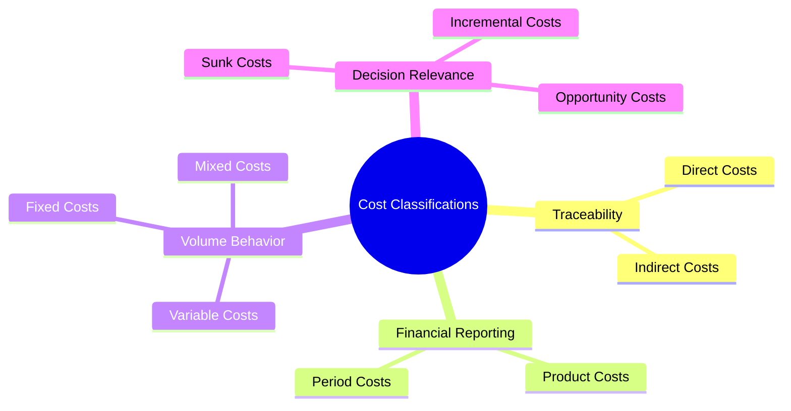

# Cost Classification Mind Map
Below is the interactive Mermaid diagram showing the classification of cost objects.

<a href="../case-studies/case-study-3-cost-allocation-abc.html" class="nav-btn">← Case Studies</a><a href="../README.html" class="nav-btn home">🏠 Home</a><a href="master-budget-flow.html" class="nav-btn">Budget Flow →</a>

