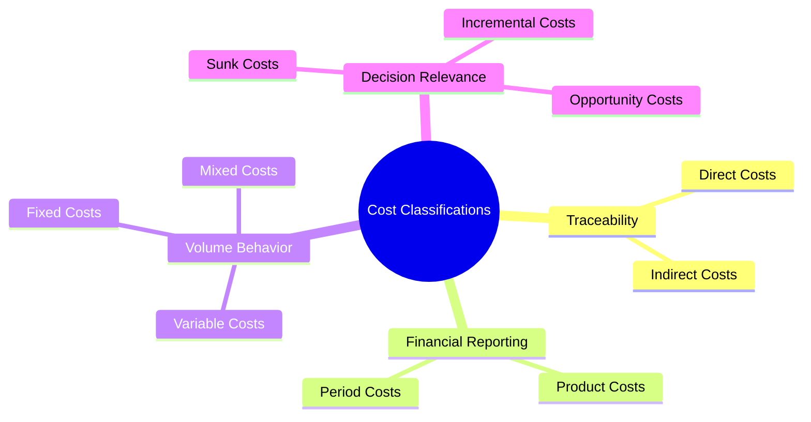

# Cost Classification Mind Map

Below is a Mermaid diagram showing the classification of cost objects.

```mermaid
mindmap
  root((Cost Classifications))
    Traceability
      Direct Costs
      Indirect Costs
    Financial Reporting
      Product Costs
      Period Costs
    Volume Behavior
      Variable Costs
      Fixed Costs
      Mixed Costs
    Decision Relevance
      Sunk Costs
      Opportunity Costs
      Incremental Costs
```
