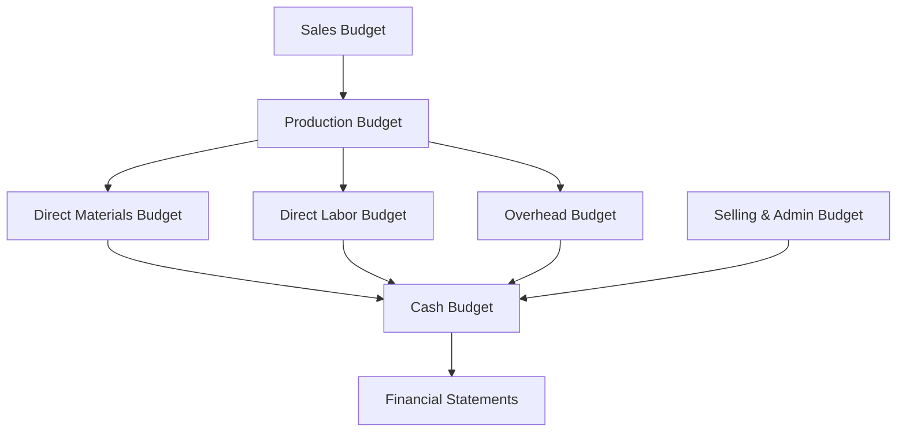

# Master Budget Cycle Flow Chart

Below is a Mermaid flowchart mapping the master budget sequence.

```mermaid
graph TD
    Sales[Sales Budget] --> Production[Production Budget]
    Production --> DM[Direct Materials Budget]
    Production --> DL[Direct Labor Budget]
    Production --> OH[Overhead Budget]
    DM --> Cash[Cash Budget]
    DL --> Cash
    OH --> Cash
    SellingAdmin[Selling & Admin Budget] --> Cash
    Cash --> Financial[Financial Statements]
```
