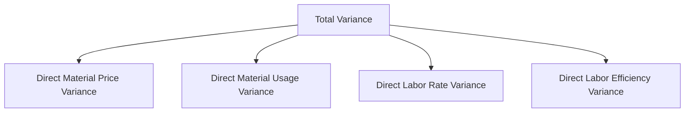

# Variance Analysis Hierarchy Tree

Below is a Mermaid tree illustrating variance relationships.

```mermaid
graph TD
    Total[Total Variance] --> Price[Direct Material Price Variance]
    Total --> Usage[Direct Material Usage Variance]
    Total --> LaborRate[Direct Labor Rate Variance]
    Total --> LaborEff[Direct Labor Efficiency Variance]
```
