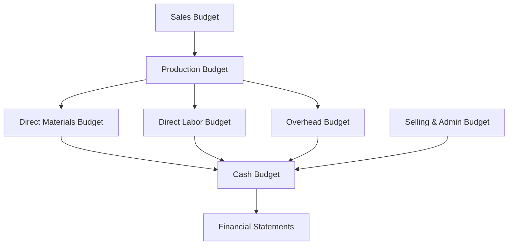

# Master Budget Cycle Flow Chart
Below is the interactive Mermaid flowchart mapping the master budget sequence.

<a href="cost-classification-mindmap.html" class="nav-btn">← Cost Mind Map</a><a href="../README.html" class="nav-btn home">🏠 Home</a><a href="variance-hierarchy.html" class="nav-btn">Variance Tree →</a>

