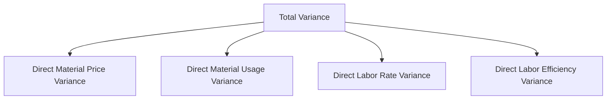

# Variance Analysis Hierarchy Tree
Below is the interactive Mermaid tree illustrating variance relationships.

<a href="master-budget-flow.html" class="nav-btn">← Budget Flow</a><a href="../README.html" class="nav-btn home">🏠 Home</a><a href="../README.html" class="nav-btn">Return Home →</a>

